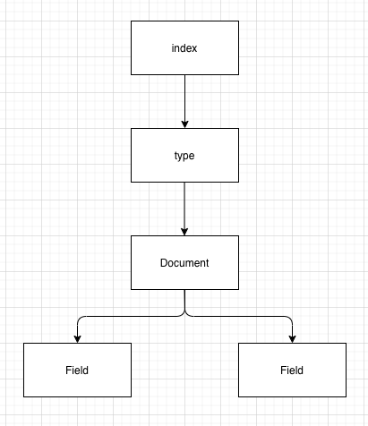

## 2장 엘라스틱서치 살펴보기


엘라스틱서치에서 사용하는 기본용어를 알아보고, 주요 API들을 살펴보기


### 엘라스틱서치를 구성하는 개념


엘라스틱치의 데이터는 인덱스, 타입, 문서, 필드 구조로 구성되어 있다.





#### 인덱스


인덱스(Index)는 데이터 저장공간이다. 하나의 타입만을 가지며, 하나의 물리적인 노드에 여러 개의 논리적인 인덱스 생성이 가능하다. 

인덱스 생성시 기본적으로 5개의 프라이머리 샤드와 1개의 레플리카 샤드 세트를 생성한다.

인덱스는 데이터 검색시에 활용되며 이름은 모두 **소문자**여야 한다. RESTful API를 통해 데이터 조작이 가능하며 인덱스가 없는 상태에서 데이터가 추가될경우 자동적으로 인덱스가 생성된다.


##### 샤딩 (sharding)

- 데이터를 분산해서 저장하는 방법
- ElasticSearch에서 스케일 아웃을 위해 index를 여러 shard로 쪼갠 것
- 작업을 여러 샤드에 분산 배치하고 병렬화 함으로써 성능/처리량을 늘릴 수 있음


##### 복제 (replica)

- 또 다른 형태의 shard라고 할수 있다.
- 노드를 손실했을 때 데이터의 신뢰성을 위해 샤드들을 복제하는것
- replica는 서로 다른 노드에 존재할 것을 권장


#### 샤드


인덱스 내부에 색인된 데이터는 물리적인 공간에 여러 개의 파티션으로 나뉘어 구성된다.

이 파티션을 **샤드 (Shard)** 라고 부른다.

샤드로 문서를 분산 저장하고 있어, 데이터 손실 위험을 최소화할 수 있다.


#### 타입


타입(Type)은 인덱스의 논리적인 구조를 의미한다. 6.0 버전 이하에서는 하나의 인덱스에 여러 타입 설정이 가능하지만 6.1 버전 부터는 불가능하다.

6.0 버전 이하에서는 타입을 특정 카테고리 분류 목적으로 사용했다.

현재는 **타입 사용을 권장하지 않기** 때문에 카테고리 별로 인덱스를 생성해야 한다.


#### 문서


문서(Document)는 **데이터가 저장되는 최소 단위**이다. (색인화 가능한 기본 단위)

기본적으로 JSON 포맷을 지원하며, 다수의 필드로 구성되어 있다.

또한 중첩 구조를 지원하기 때문에 문서 안에 문서를 지정하는 것도 가능하다.


#### 필드


필드(Field)는 문서를 구성하기 위한 속성이다. 관계형 데이터베이스의 컬럼(Column)과 비교했을때, 좀 더 동적인 데이터 타입이다.

하나의 필드는 다수의 데이터 타입을 가질수 있다.

예를 들어 제목을 검색할 때 매칭 검색과 초성 검색이 모두 지원되도록 2개의 데이터 타입을 지정할 수 있다.


#### 매핑


매핑(Mapping)은 문서의 필드 및 필드 속성을 정의하고, 색인 방법을 정의하는 프로세스이다.

매핑 정보에 필드명을 중복해서 사용할 수 없다.


> 여러 개의 도큐먼트는 하나의 타입을 이루고, 여러 개의 타입은 하나의 인덱스로 구성된다. (6.0 이하 기준)


### 엘라스틱서치 데이터 구조


엘라스틱 서치는 문서 (Document)를 인덱스로 만든 뒤, 샤드로 분리하여 관리한다.

각각의 샤드는 **루씬 인덱스** 이기도 하다.


루씬은 새로운 데이터 저장시 **세그먼트 (Segment)** 를 생성하는데, 이 세그먼트를 조합해 데이터 검색을 할 수 있다.

> 색인 (indexing) 처리량이 중요할 때는 세그먼트를 더 생성하기도 하지만, 루씬은 순차적으로 세그먼트를 검색하기 때문에 세그먼트 수가 많아질수록 검색속도도 느려지게 된다.


##### 세그먼트 (Segment)


엘라스틱서치에 새로운 데이터를 저장하면, 새로 검색가능한 세그먼트를 만들기 위해 새로운 세그먼트를 디스크에 기록하여 Refresh 한다. 

이를 **searchable segment** 라고한다.

엘라스틱서치는 세그먼트를 fsync 하는 flush를 주기적으로 진행하고 불필요한 트랜잭션 로그를 제거한다.

이를 **committed segment**라고한다.


세그먼트는 **불변성을 유지**하며, 수정이 일어났을때 삭제된 데이터 표시를 하고 새로운 데이터를 가리킨다.

오래된 삭제 데이터를 지우는 것을 **merge process** 라고 한다.


### 노드


노드는 클러스터에 포함된 단일 서버로서 데이터를 저장하고 클러스터의 색인화 및 검색기능에 참여한다.

노드는 클러스터와 동일하게 이름으로 식별되는데, 기본 값은 UUID이다.


노드는 클러스터 명을 통해 특정 클러스터로 구성될 수 있다. 기본 값은 'elasticsearch' 라는 이름의 클러스터에 포함된다.

> 네트워크에서 다수의 노드를 실행할 경우, 이 노드들은 elasticsearch라는 단일 클러스터를 형성하고 구성하게 된다.


### 노드의 종류


관계형 데이터베이스의 경우 모든 요청을 하나의 서버에서 처리하지만, 엘라스틱서치는 분산처리가 가능하기 떄문에 대용량 처리가 가능하다.

분산 처리를 위해 다양한 노드들을 조합해서 클러스터를 구성해야한다. 노드들도 각 유형이 존재하며 엘라스틱서치가 제공하는 노드 의 유형들은 다음과 같다.


#### 마스터 노드


마스터 노드는 인덱스 생성, 삭제 등 클러스터와 연관된 작업을 처리한다.

네트워크 속도가 빠르고 지연이 없는 노드를 마스터 노드로 선정해야 하며, 하나의 노드만이 마스터 노드로 선출된다.


`elasticsearch.yml 설정` 

````yaml
node.master: true
node.data: false
node.ingest: False
search.remote.connect: false
````


#### 데이터 노드


데이터 노드는 문서가 저장되는 노드이며, 샤드가 배치되는 노드이기도 하다.

색인 작업은 리소스를 많이 소모하기 때문에 마스터 노드와 분리하여 구성하는게 좋다.


`elasticsearch.yml 설정`

````yaml
node.master: false
node.data: true
node.ingest: false
search.remote.connect: false
````


#### 코디네이팅 노드


요청을 단순히 **라운드로빈** 방식으로 분산시켜 주는 노드이다.


##### 라운드 로빈 스케쥴링

- 시분할 시스템을 위해 설계된 선점형 스케쥴링 이다.
- 프로세스들 사이에 우선순위를 두지 않고, 순서대로 **시간 단위(Time Quantum/Slice)** 로 CPU를 할당하는 방식의 스케쥴링 알고리즘이다.


`elasticsearch.yml 설정`

````yaml
node.master: false
node.data: false
node.ingest: false
searc.remote.connect: false
````


#### 인제스트 노드


색인에 앞서 데이터 전처리를 위한 노드이다. 데이터 포맷을 변경하기 위해 스크립트로 전처리 파이프라인을 구성하고 실행할 수 있다.


`elasticsearch.yml 설정`

````yaml
node.master: false
node.data: false
node.ingest: true
search.remote.connect: false
````


> 각 노드들은 설정에 따라  여러 개의 유형을 겸해서 동작할 수도 있다.

### 엘라스틱서치 실행


- bin/elasticsearch
- -d, -p 옵션을 제공한다.
- -d: 백그라운드로 실행
- -p <파일명>: 엘라스틱서치의 프로세스 id를 <파일명> 으로 지정된 파일에 저장한다.
  - pid 파일은 실행중인 프로세스가 종료되면 자동으로 삭제된다.
- 별도 설정을 하지않으면 기본적으로 9200포트를 사용한다.


> 0.90.* 이전 버전에서는 bin/elasticsearch 명렁이 기본적으로 **백그라운드 실행** 이었다.
>
> -f 옵션을 사용해야지만 포그라운드로 실행


#### 현재 프로세스 정보 가져오기


curl -XGET http://localhost:9200 명령어를 사용해서 현재 실행중인 엘라스틱서치 프로세스 정보를 알 수 있다.


####  환경설정


- elasticsearch.yml
- 실행시 -D 옵션 또는 -- 옵션사용
- 실행후 REST API 를 이용한 설정


##### elasticsearch.yml


엘라스틱서치의 주요 환경설정의 대부분을 설정한다.


`클러스터 설정`

````yaml
# cluster.name: elasticsearch
````


> 클러스터 명은 엘라스틱서치를 설치했을때 반드시 바꿔주는것이 좋다.


클러스터 명 을 ncucu 로 변경하고, 엘라스틱서치 실행뒤, curl -XGET localhost:9200/_cluster/stats?pretty=true 로 확인


#### 노드


클러스터 다음에 존재하는 설정은 노드에 대한 설정이다.


`노드 설정`

````yaml
# node.name: node-1
````


노드명을 nucu-1 로 변경하고 엘라스틱서치 실행 로그를 확인하면 노드명이 ncucu-1로 변경되었다.


#### 그외


위 두가지 외에도 다양한 설정이 존재한다. 파일 경로설정, 메모리, 네트워크 등등..


##### Log4j2.properties


엘라스틱서치는 Log4j 2 를 이용해서 로깅을 한다.

Log4j2.properties를 이용해 로깅관련 설정이 가능하다.


### 엘라스틱 서치 제공 API


- 인덱스 관리 API
- 문서 관리 API
- 검색 API
- 집계 API


문서를 색인하기 위해서는 인덱스라는 그릇을 생성해야 한다.

인덱스를 통해 입력되는 문서의 필드를 정의하고, 데이터 타입을 지정할 수 있으며 이를 통해 효율적인 색인이 가능해진다.


뒤에도 관련 내용들이 많이 있기 때문에, 모든 API를 살펴보진 않고, 주로 많이 사용하게 될 Document 관련 API 들을 살펴보자.

여기서는 **스키마리스** 기능을 활용해서 살펴볼텐데, 이 기능은 되도록 사용하지 않는것이 좋다.

성능과 밀접한 연관이 있기때문에 **가급적 사용하지 않는것을 권장**한다.


#### 데이터 입력


엘라스틱서치 도큐먼트는 POST, PUT 메소드를 사용해서 입력이 가능하다.


`요청`

````shell
curl -XPUT -H "Content-Type: application/json" http://localhost:9200/teams/team/1 -d '{ 
	"title": "TalkStore", 
	"creator": "ncucu"
 }' 
````


`응답`

````shell
{"_index":"teams","_type":"team","_id":"1","_version":1,"result":"created","_shards":{"total":2,"successful":1,"failed":0},"_seq_no":0,"_primary_term":1}
````


같은 요청을 한번 더 보내서 갱신할경우 결과는 다음과 같다.

````shell
{"_index":"teams","_type":"team","_id":"1","_version":2,"result":"updated","_shards":{"total":2,"successful":1,"failed":0},"_seq_no":1,"_primary_term":1}
````


> 이미 존재하는 도큐먼트의 내용을 수정하는 명령으로 인식하였기 때문에
>
> result: updated, version이 1 증가하였고, seq_no도 1 만큼 증가하였다.


#### 데이터 삭제


데이터 삭제는 도큐먼트, 타입, 인덱스 단위로 삭제할 수 있으며, DELETE 메소드를 활용한다.


`요청`

````shell
curl -XDELETE http://localhost:9200/teams/team/1
````


`응답`

````shell
{"_index":"teams","_type":"team","_id":"1","_version":3,"result":"deleted","_shards":{"total":2,"successful":1,"failed":0},"_seq_no":2,"_primary_term":1}
````


> 응답을 잘 살펴보면 삭제 요청을 했음에도 불구하고, version과 seq_no가 증가한것을 볼 수 있다.


삭제한 도큐먼트를 다시 조회 할 경우 결과는 다음과 같다.

````shell
{"_index":"teams","_type":"team","_id":"1","found":false}
````


> 도큐먼트를 삭제하더라도, 메타 정보는 여전히 남아있다.


이번에는 삭제한 도큐먼트 ID에 데이터를 입력한 결과이다.

````shell
{"_index":"teams","_type":"team","_id":"1","_version":4,"result":"created","_shards":{"total":2,"successful":1,"failed":0},"_seq_no":2,"_primary_term":1}
````


> 도큐먼트의 삭제는 도큐먼트가 실제로 삭제되는 것이 아니라, 도큐먼트의 데이터 값이 빈 값으로 업데이트되고
>
> 검색되지 않게 상태가 변경되는 것이다.


#### 데이터 업데이트 (_update) API


엘라스틱서치는 입력된 도큐먼트를 수정할 수 있는 _update API를 제공한다.

_update API는 **doc** , **script** 두 개의 매개변수를 이용해 데이터 제어가 가능하다.


doc는 도큐먼트에 새로운 필드를 추가하거나 기존 필드값을 변경할 때 사용한다.

script는 좀 더 복잡한 프로그래밍 기법을 사용해 입력된 내용에 따라 필드의 값을 변경하는 등의 처리에 사용한다.


_update API는 POST 메소드를 사용한다.


##### doc


`요청`

````shell
curl -XPOST -H "Content-Type: application/json" http://localhost:9200/teams/team/1/_update -d '{
	"doc": {
		"date": "2020-06-17"
	}
}'
````


`결과`

````shell
curl -XGET http://localhost:9200/teams/team/1?pretty=true
{
  "_index" : "teams",
  "_type" : "team",
  "_id" : "1",
  "_version" : 9,
  "_seq_no" : 11,
  "_primary_term" : 1,
  "found" : true,
  "_source" : {
    "title" : "TalkStore",
    "creator" : "ncucu",
    "date" : "2020-06-17"
  }
}
````


> 이런 간단한 수정의 경우에는 데이터 입력에서 살펴본 **PUT요청** 으로도 수행이 가능하다.


##### script


sccript 매개 변수는 도큐먼트의 내용에 다양한 연산 적용이 가능하다.

MVEL 언어의 문법을 사용해서 처리된다. MVEL은 자바 런타임 플랫폼 위에서 동작하기 위해 만들어진 언어이기 때문에 자바 문법과 유사하게 동작한다.

- http://mvel.documentnode.com/


script 기능을 테스트하기 위해 기존 도큐먼트의 구조를 변경 (memberCount 필드를 추가)

````shell
curl -XPOST -H "Content-Type: application/json" http://localhost:9200/teams/team/1/_update -d '{
	"doc": {
		"memberCount": 0
	}
}'

curl -XGET http://localhost:9200/teams/team/1?pretty=true
{
  "_index" : "teams",
  "_type" : "team",
  "_id" : "1",
  "_version" : 10,
  "_seq_no" : 12,
  "_primary_term" : 1,
  "found" : true,
  "_source" : {
    "title" : "TalkStore",
    "creator" : "ncucu",
    "date" : "2020-06-17",
    "memberCount" : "0"
  }
}
````


`ctx._source 명령`


`요청`

````shell
curl -XPOST -H "Content-Type: application/json" http://localhost:9200/teams/team/1/_update -d '{
	"script": "ctx._source.memberCount += 10"
}'
````


`결과`

````shell
curl -XGET http://localhost:9200/teams/team/1?pretty=true
{
  "_index" : "teams",
  "_type" : "team",
  "_id" : "1",
  "_version" : 13,
  "_seq_no" : 15,
  "_primary_term" : 1,
  "found" : true,
  "_source" : {
    "title" : "TalkStore",
    "creator" : "ncucu",
    "date" : "2020-06-17",
    "memberCount" : 10
  }
}
````


> 5.0버전 부터는 Elasticsearch에서 직접 개발한 **Painless** 스크립트를 사용한다.

- https://www.elastic.co/guide/en/elasticsearch/reference/5.0/modules-scripting-painless.html


`creator 필드가 cu 를 포함하면 멤버 카운트를 100만큼 증가`


script를 활용하면 if 문을 이용한 조건문 처리도 가능하다.

다음 예제는 **Painless 스크립트**를 사용했으며, **creator가 cu 를 포함**할 경우, 멤버의 카운트를 100만큼 증가시키고, 아닐경우 200 만큼 증가시킨다.


`요청`

````shell
curl -XPOST -H "Content-Type: application/json" http://localhost:9200/teams/team/1/_update -d '{
	"script": {
		"inline": "if(ctx._source.creator.contains(params.name)) { ctx._source.memberCount += 100 } else { ctx._source.memberCount += 200}",
		"lang": "painless",
		"params": { "name": "cucu" }
	}
}'
````


`결과`

````shell
curl -XGET http://localhost:9200/teams/team/1?pretty=true
{
  "_index" : "teams",
  "_type" : "team",
  "_id" : "1",
  "_version" : 14,
  "_seq_no" : 25,
  "_primary_term" : 1,
  "found" : true,
  "_source" : {
    "title" : "TalkStore",
    "creator" : "ncucu",
    "date" : "2020-06-17",
    "memberCount" : 110
  }
}
````


contains() 외에도 자바 언어에서 사용하는 ==, =< 과 같은 비교연산도 수행할 수 있다.

이 외에도 ctx.op 명령을 이용하면 필드 조건에 따라 도큐먼트를 삭제하는 등 다양한 처리가 가능하다.


#### 파일을 이용한 데이터 처리


curl을 이용한 데이터 입력시 -d 옵션을 활용해 본문을 직접 입력했다.

이 외에도 입력할 데이터의 내용을 미리 파일에 기록한뒤 다음과 같은 방식으로 입력이 가능하다.

````shell
curl -X{메서드} http://{host}:{port}/{인덱스}/{타입}/{도큐먼트 id} -d @{파일명}
````


`요청`

````shell
echo '{ "title": "채널개발파트", "creator": "ryan", "date": "2020-06-15", "memberCount": 10  }' > channel

cat channel
{ "title": "채널개발파트", "creator": "ryan", "date": "2020-06-15", "memberCount": 10  }

curl -XPUT -H "Content-Type: application/json" http://localhost:9200/teams/team/2 -d @channel
````


`결과`

````shell
curl -XGET http://localhost:9200/teams/team/2?pretty=true
{
  "_index" : "teams",
  "_type" : "team",
  "_id" : "2",
  "_version" : 1,
  "_seq_no" : 26,
  "_primary_term" : 1,
  "found" : true,
  "_source" : {
    "title" : "채널개발파트",
    "creator" : "ryan",
    "date" : "2020-06-15",
    "memberCount" : 10
  }
}
````


#### 벌크 API를 이용한 배치 작업 (_bulk)


엘라스틱서치는 여러 명령을 한꺼번에 실행할 수 있도록 벌크 API 를 제공한다.

특히 많은 도큐먼트를 한꺼번에 색인할 때 벌크 API를 사용하면 색인에 소요되는 시간을 크게 줄일 수 있다.


````shell
curl -XPOST http://{host}:{port}/{인덱스}/{타입}/_bulk -d '{데이터}' or @{파일명}
curl -XPOST http://{host}:{port}/{인덱스}/_bulk -d '{데이터}' or @{파일명}
curl -XPOST http://{host}:{port}/_bulk -d '{데이터}' or @{파일명}
````


벌크 API 는 index, create, delete, update 4가지 를 수행할 수 있다.

delete를 제외한 나머지 동작은 실행 정보와 요청 데이터가 있어야한다.

**벌크 API 요청시 실행메타 정보와, 요청 데이터를 번갈아가면서 입력해야 한다. (한 라인에 한 정보씩 제공)**


````json
{ "index": {"_index": "books", "_type": "book", "_id": 1}} // index 실행 메타정보
{ "field": "value"} // index 요청 데이터
{ "delete": { "_index": "books", "_type": "book", "_id": "2"}} // delete 실행 메타정보
````


`요청`

````shell
curl -XPOST -H "Content-Type: application/json" http://localhost:9200/_bulk -d '
{ "index": {"_index": "books", "_type": "book", "_id": 1}} 
{ "field": "value"}
'
````


`결과`

````shell
curl -XGET http://localhost:9200/books/book/1?pretty=true
{
  "_index" : "books",
  "_type" : "book",
  "_id" : "1",
  "_version" : 1,
  "_seq_no" : 0,
  "_primary_term" : 1,
  "found" : true,
  "_source" : {
    "field" : "value"
  }
}
````


> books 인덱스, book 타입의 1번 도큐먼트가 생성되었다.


벌크 API 도 다른 API들과 마찬가지로 파일을 이용해서 호출이 가능한데 이때 옵션을 -d가 아닌 **--data-binary를 사용**해야 한다.


#### 주의점


벌크 API를 활용한 배치 작업은 보통 1,000 ~ 5,000개 정도가 배치 1회당 작업량으로 바람직하며 10,000개 이상의 작업을 배치로 실행할 경우 오류가 발생할 확률이 높다.


#### 벌크 UDP API


엘라스틱서치는 UDP 프로토콜을 통한 벌크 처리를 지원한다.

이 기능을 사용하려면 별도의 설정이 필요하다.


`elasticsearch.yml`

````yaml
bulk.udp.enabled: true
````


위 설정을 한뒤 엘라스틱을 재 실행하면, 9700 포트를 통해 bulk 기능이 실행된다.

벌크 기능을 통해 사용가능한 API들은 기존과 동일하다.
